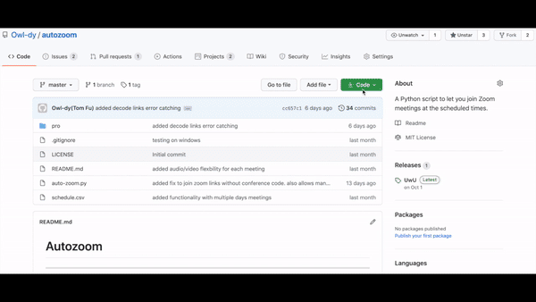

# Autozoom
--------
## What does it do and who is it for?

Autozoom is a super simple Python script to launch your Zoom meetings at the scheduled times, making sure you "showing up" on time, :wink:. 

There is no pip installation or dependency hell at all, so that it is easy to use for most of non-tech-savvy students/professionals. :man_student: :briefcase:

*"It is simplier than hosting a Minecraft server, kids"* :boy:

------
## Instructions
### Prerequisites
- Have [Python3](https://www.python.org/downloads/) installed. Make sure to pick the right version for you OS.
- Have [Zoom](https://zoom.us/download) client installed.
### How to start
1. `cd` into directory 
2. Edit the `schedule.csv` file formatted like the following:

| zoom-links |	date (blank for today) | meeting start time | meeting end time |
|--------------------------------------------------|--------|-----|-----|
|https://zoom.us/j/<conference_code>?pwd=<pa11word>|		|09:45|10:30|
|https://zoom.us/j/<conference_code>?pwd=<pa22word>|09/21/2020|12:45|13:30|
|https://zoom.us/j/<conference_code>?pwd=<pa33word>|MM/DD/YYYY|HH:MM|HH:MM|
3. Be careful, the earliest meeting on top and in order. Make sure the formats are correct, and end time of each meeting is after the start time
4.  start the program `python auto-zoom.py` *(trick: if using non-Windows OS, do `screen python auto-zoom.py` instead and `CTR+A then D` to run in the background, or else you need to keep your terminal open)*

### Detailed instructions for non-technical users

1. Have the prerequisites done (Zoom Client set up like you normally would and download Python3 from the link above)
2. Download the code from this page
3. Extract / Unzip the file
4. Edit the schedule.csv file 
5. Then....
#### If you are using a Mac :apple:
1. Follow the gif tutorial above
2. Search for **Terminal** and open it
3. In the **Terminal** type `python` then drag `auto-zoom.py` to the **Terminal**. You should have something like `python /Users/owl-dy/autozoom/auto-zoom.py`
4. Confirm the meetings are processed and wait to auto-join the meetings, or close window to terminate the process
#### If you are using a PC :computer:
1. You can follow the gif tutorial above except
2. In **Start** menu search of `cmd` and open it
3. In the **CMD** type `python` then drag `auto-zoom.py` to the **CMD**. You should have something like `python \Users\owl-dy\downloads\autozoom\auto-zoom.py`
4. Confirm the meetings are processed and wait to auto-join the meetings, or close window to terminate the process

### Autozoom-pro
Check out [/pro](https://github.com/Owl-dy/autozoom/tree/master/pro) directory for more functionalities.
These functionalities are still under constant updates/improvements. Starred this repo to follow more updates.

## Other things about this project
### Inspiration & acknowledgement
- Inspired from this [CNET](https://www.youtube.com/watch?v=b-VCzLiyFxc) video
- I also saw a similar attempt on this [github repo](https://github.com/Kn0wn-Un/Auto-Zoom). However, his method uses image recognition, which requires some installations that are not so frindly to non-tech persons, and it only works on Windows. 
### Future stage (please join me!)
- Want to be able to have a trigger word for Zoom's audio output, so whenever you are called on, autozoom can play a pre-recorded audio file to fake your presence
- Want to redirect audio output to a NLP service, and play back pre-recorded audio based on the content of the input audio
